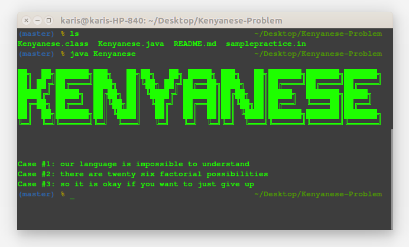

## 
KENYANESE PROBLEM

Assume that there is a natural spoken language called **Kenyanese**. To translate text into Kenyanese, we take any message and replace each English letter with another English letter. This mapping is one-to-one and onto, which means that the same input letter always gets replaced with the same output letter, and different input letters always get replaced with different output letters. A letter may be replaced by itself. Spaces are left as-is.

#### For example 

Our awesome translation algorithm includes the following three mappings: 'a' -> 'y', 'o' -> 'e', and 'z' -> 'q'. This means that "a zoo" will become "y qee". 
Kenyanese is based on the best possible replacement mapping, and we will never change it. It will always be the same. In every test case. We will not tell you the rest of our mapping because that would make the problem too easy, but there are a few examples below that may help.

Given some text in Kenyanese, can you translate it to back to normal text?

### Input

The first line of the input gives the number of test cases, T. T test cases follow, one per line. 
Each line consists of a string G in Kenyanese, made up of one or more words containing the letters 'a' - 'z'. There will be exactly one space (' ') character between consecutive words and no spaces at the beginning or at the end of any line. 

### Output

For each test case, output one line containing "Case #X: S" where X is the case number and S is the string that becomes G in Kenyanese. 

### Limits

1 ≤ T ≤ 30.
G contains at most 100 characters.
None of the text is guaranteed to be valid English.

### Input

Case #1: ejp mysljylc kd kxveddknmc re jsicpdrysi
Case #2: rbcpc ypc rtcsra dkh wyfrepkym veddknkmkrkcd
Case #3: de kr kd eoya kw aej tysr re ujdr lkgc jv

### Output 

Case #1: our language is impossible to understand
Case #2: there are twenty six factorial possibilities
Case #3: so it is okay if you want to just give up

## IMAGE OF WORKING DEMO!

